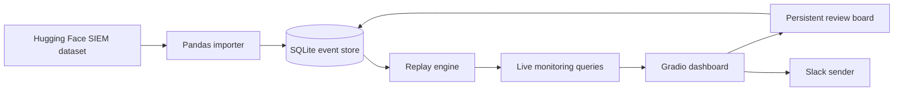

# ClawWatch Log Lab: Slide Creation Content

This document is the source material for a short project presentation. It starts with the
features that are working now, then explains the problem, implementation, results, and next
phase. The wording distinguishes the completed prototype from the planned cybersecurity
agent work.

## 1. Project features

### Working features

| Feature | What it does | Evidence to show |
| --- | --- | --- |
| Synthetic SIEM dataset | Uses 100,000 security events from `darkknight25/Advanced_SIEM_Dataset`, pinned to a specific revision and SHA-256 digest. | Dataset profile, event counts, and checksum output. |
| Repeatable setup | Creates a Python 3.12 virtual environment, installs locked dependencies, verifies or downloads the dataset, validates configuration, and imports into SQLite. | `./scripts/setup.sh` output. |
| Pandas import pipeline | Reads JSONL in bounded 10,000-row batches, normalizes events, records malformed rows, and resumes safely after interruption. | Import progress and final accepted/rejected counts. |
| Local SQLite storage | Stores source events, replay sessions, emitted events, review items, notes, stage changes, and import history in `var/clawwatch_demo.sqlite3`. | Database summary and schema diagram. |
| Live event replay | Replays historical events as a live stream with start, pause, resume, stop, rate, limit, severity, event type, and ordering controls. | Replay control panel and moving event feed. |
| Engineer monitoring dashboard | Presents counters, severity charts, event trends, searchable logs, event details, original payloads, and run history in a dark Grafana-style Gradio interface. | Dashboard screenshot or recorded walkthrough. |
| Incident review board | Moves selected events through Triage, Investigating, Monitoring, and Resolved columns. Notes, stage history, and revisions persist in SQLite. | Kanban board and activity history. |
| Slack message delivery | Sends a plain-text alert through Slack `chat.postMessage` using credentials stored in `.env`. Supports dry runs, channel overrides, standard input, and readable API errors. | Terminal output and one test-channel message. |
| Deployment scripts | Provides commands to set up the project, start Gradio, and send Slack alerts. | `scripts/setup.sh`, `scripts/start_gradio.sh`, and `scripts/send_slack.sh`. |
| Remote server workflow | Runs on the Dell server, keeps the large dataset outside Git tracking, and preserves the data across future pulls. | Remote checksum, completed import status, and Git status. |

### Measured results

| Check | Result |
| --- | --- |
| Dataset size | 100,000 source events, 93,724,615 bytes |
| Dataset integrity | SHA-256 `b30902649de9197376e7b245045c6f6721ba3039edc1b7cac3474cc2ad0c4f21` |
| Remote import | 100,000 accepted, 0 rejected, 0 duplicates in 5.28 seconds |
| Local import benchmark | About 24,778 rows per second in the recorded clean import |
| Replay stress test | 99.9 events per second for a 1,000-event run |
| Full-corpus test | 100,000 unique replay sequences and source events persisted |
| Dashboard query time | 0.250 to 0.259 seconds across five full-run snapshots |
| Automated checks | 39 tests passing, plus Ruff lint and format checks |
| Browser checks | Reviewed at 1440 x 900 and 1280 x 800 without horizontal page overflow |

## 2. Short project introduction

### One-sentence version

I built ClawWatch Log Lab, a local security operations demo that turns a large historical SIEM
dataset into a controllable live stream, stores every event in SQLite, and gives engineers a
dashboard and review workflow for investigation.

### Thirty-second version

Security teams often have large volumes of logs but need a fast way to reproduce activity,
inspect evidence, and coordinate review. I built a Python 3.12 application that imports
100,000 synthetic SIEM events with pandas, replays them as live traffic, and monitors the
result in a Grafana-style Gradio dashboard. Engineers can search events, inspect raw payloads,
move suspicious items across a persistent review board, and send an alert to Slack. The app
runs locally with SQLite and also works on the Dell server.

### What I personally implemented

- I assessed the Hugging Face dataset and confirmed that it contains useful authentication,
  endpoint, firewall, network, cloud, IoT, IDS, and AI security events.
- I built the project structure, configuration model, dependency locks, SQLite migrations,
  pandas importer, replay engine, monitoring queries, review workflow, and Gradio interface.
- I added scripts for setup, dashboard startup, and Slack delivery.
- I tested the application locally and on the Dell server, including data transfer, checksum
  verification, remote import, replay, and behavior across Git pulls.
- I documented the next phase for an OpenClaw investigation agent with local GB10 inference.

## 3. Recommended slide sequence

The outline below fits a five-minute presentation. Each slide has one main point and a clear
piece of evidence.

### Slide 1: What I built

**Title:** ClawWatch turns historical SIEM data into a live investigation workspace

**On-slide copy:**

- 100,000 security events replayed as live logs
- Local SQLite evidence and replay history
- Grafana-style monitoring with persistent incident review
- Slack alert delivery through a controlled script

**Speaker notes:**

I built a complete local log replay and monitoring foundation for a cybersecurity agent. The
prototype starts with a pinned SIEM dataset, replays events at a controlled rate, and gives an
engineer one place to inspect evidence and manage review. I also added Slack delivery and a
repeatable remote deployment workflow.

**Visual:** Use one strong dashboard screenshot. Add four small labels that point to replay
controls, live metrics, the event table, and the review board.

### Slide 2: The problem

**Title:** Security logs contain evidence, but investigation context is fragmented

**On-slide copy:**

- High event volume makes manual inspection slow.
- Historical logs are difficult to demonstrate as live incidents.
- Investigation decisions and notes often sit outside the event record.
- Notifications need evidence and a clear destination.

**Speaker notes:**

The challenge was broader than displaying JSON. I needed repeatable ingestion, durable replay,
fast monitoring queries, a human review process, and a safe path to notify a team. The project
creates that foundation before adding autonomous investigation.

**Visual:** Show a simple before-and-after composition. The left side has scattered log lines.
The right side shows one ClawWatch event with evidence, status, and review ownership.

### Slide 3: Data and ingestion

**Title:** A verified data pipeline makes every demo repeatable

**On-slide copy:**

- Pinned Hugging Face repository revision and SHA-256 digest
- Pandas processing in 10,000-row batches
- Idempotent import with progress and recovery state
- 100,000 accepted events with zero rejected rows on the Dell server

**Speaker notes:**

I first sampled and profiled the dataset to confirm it matched the security use case. The setup
script verifies the full file and downloads it when missing. The importer uses pandas for
bounded batch processing and commits progress to SQLite. Re-running the import does not create
duplicate source events.

**Visual:** Use a horizontal flow: Hugging Face dataset, checksum gate, pandas batches, SQLite.
Place the remote import result, 100,000 accepted in 5.28 seconds, as the main metric.

### Slide 4: System architecture

**Title:** Local components keep the demo simple and inspectable

**On-slide labels:**

- Python 3.12
- Gradio and pandas
- Repository-local SQLite
- Slack Web API

**Speaker notes:**

The architecture uses a small number of local components. SQLite holds both the source data
and operational state. The replay engine commits each emitted event with its cursor, so an
interruption cannot silently skip or duplicate replay progress. The interface reads the same
database and persists every review action.

**Visual:** Recreate the Mermaid flow as the main slide graphic. Keep the components large and
avoid a grid of small cards.

### Slide 5: Live monitoring and review

**Title:** The dashboard connects system activity with human investigation

**On-slide copy:**

- Live rate, severity, event type, and ordering controls
- Searchable event feed with raw payload inspection
- Metrics and charts calculated with pandas
- Persistent review stages, notes, and activity history

**Speaker notes:**

The interface is designed for engineers. I replaced the plain Gradio appearance with a dark,
dense monitoring layout. An engineer can start a replay, filter the feed, open the original
event, and create a review item. The Kanban board keeps the investigation state after a refresh
or process restart.

**Visual:** Use two screenshots. The main image shows live monitoring. A smaller crop shows one
review item moving from Triage to Investigating.

### Slide 6: Engineering reliability

**Title:** Durable state and validation make the prototype safe to demonstrate

**On-slide copy:**

| Area | Implementation evidence |
| --- | --- |
| Replay recovery | Cursor and emitted event commit together |
| Data integrity | Pinned revision and checksum verification |
| Secret handling | Slack token stays in ignored `.env` |
| Deployment | Setup and launch scripts use Python 3.12 |
| Quality | 39 automated tests plus Ruff checks |

**Speaker notes:**

I focused on failure behavior because live demos often break at integration boundaries. The
database records interrupted replay state. Slack failures return readable errors without
printing the token. The dataset remains outside Git tracking, so pulls do not replace the
93.7 MB file. Setup can recover a missing file from the pinned Hugging Face revision.

**Visual:** Use one terminal capture with a passing setup or test result beside a small SQLite
state diagram.

### Slide 7: Results and next phase

**Title:** The monitoring foundation is ready for agent investigation

**On-slide copy:**

**Completed now**

- Verified ingestion and durable replay
- Live monitoring and persistent review
- Slack delivery and Dell server deployment

**Next phase**

- OpenClaw agent investigates suspicious sequences
- Local model inference runs on the GB10
- Evidence validation controls severity and team routing

**Speaker notes:**

The completed prototype handles the data and operational workflow that an agent needs. The
next phase adds OpenClaw and a local GB10 model to correlate related events, explain why a
sequence needs attention, and select an approved Slack destination. I will keep the same human
review boundary and require every alert to cite stored event IDs.

**Visual:** Show the current architecture in solid color. Add the planned agent and local model
as a clearly labeled next-phase extension.

## 4. Suggested demo sequence

Use a 60 to 90 second recording inside the presentation.

| Time | Action | What the audience should notice |
| --- | --- | --- |
| 0:00 to 0:10 | Show the completed dataset and source-event count. | The demo starts from verified data. |
| 0:10 to 0:25 | Start a 10 events-per-second replay. | Counters and charts update as events arrive. |
| 0:25 to 0:40 | Filter for critical AI or authentication events. | Search and filters reduce the investigation set. |
| 0:40 to 0:55 | Open one event and inspect its raw JSON. | Normalized fields remain traceable to the source. |
| 0:55 to 1:10 | Add the event to review and move its stage. | The investigation workflow persists in SQLite. |
| 1:10 to 1:25 | Send a prepared critical alert to the test Slack channel. | The workflow reaches an external team. |
| 1:25 to 1:30 | Show the Dell server status. | The same project runs outside the development laptop. |

## 5. Presentation asset checklist

- Dashboard overview at 1440 x 900
- Close crop of replay controls and live counters
- Critical AI or authentication event detail
- Review board with at least two populated stages
- Slack test-channel message with secrets and personal data hidden
- Remote `db-info` output showing 100,000 source events and a complete dataset
- Import result showing 100,000 accepted and zero rejected
- Architecture diagram based on the Mermaid source above
- One slide footer stating that the dataset and replay are synthetic

## 6. Claims to keep precise

- Call the current product a log replay, monitoring, and review prototype.
- State that Slack delivery works through the project script.
- Present OpenClaw investigation and local GB10 inference as the next phase until they are
  implemented and demonstrated.
- Describe the SIEM records as synthetic data from the named Hugging Face dataset.
- Use the measured import, replay, query, and test results in this document. Avoid claims about
  production scale, detection accuracy, or breach prevention.
- Explain that SQLite fits the bounded local demo. A production deployment would need separate
  capacity, access-control, retention, and reliability work.

## 7. Closing statement

I built the data and operations foundation for a local cybersecurity investigation agent.
ClawWatch can ingest a large SIEM dataset, replay it as live activity, preserve evidence and
review state, and notify a team through Slack. The next step is to connect OpenClaw and a local
GB10 model so every alert includes a bounded investigation, cited evidence, and controlled
routing.
