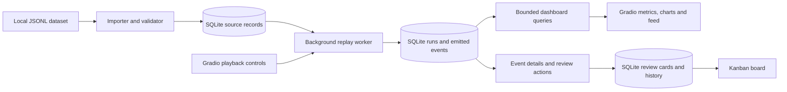

# Gradio live-log replay and SQLite demo plan

Status: **complete; all six phases have been implemented and validated**.
Date: 2026-10-03.
Project: `hackathon_dell`; proposed application name: **ClawWatch Log Lab**.

## 1. Intended result

Build a local Python application that reads the downloaded SIEM dataset, replays its records as a live stream, persists all source records and emitted events in SQLite, and displays a Grafana-style monitoring dashboard with a Kanban review board in Gradio.

Confirmed design direction: **Grafana-style dashboard plus Kanban**, with dark monitoring panels, counters, charts, and a live log feed. Grafana itself is not a required service. The Kanban board tracks review of individual mock events; it does not imply that the app detected a real incident.

The initial deliverable is a mock data and monitoring application. It runs without model inference, OpenClaw, Slack, a GPU, or an external database. It gives the later cybersecurity agent a durable local event source.

### Main user flow

1. Launch the app from a Python 3.12 virtual environment.
2. Import the existing dataset into a local SQLite file, with progress and validation counts.
3. Choose a replay preset and rate, then press **Start**.
4. Watch persisted events appear in the live feed, counters, and charts.
5. Open an event, inspect its original payload and replay metadata, and optionally add it to the review board.
6. Move its card through **New → Investigating → Resolved**, or **Dismissed**.
7. Pause, resume, stop, or start another run without deleting earlier logs.
8. Restart the application and inspect previous runs and review decisions.

## 2. Existing evidence and constraints

The repository currently contains the dataset inspection artifacts and a minimal README, with no application or Python packaging configuration. Python **3.12.9** is available locally.

Input file: `data/advanced_siem/raw/advanced_siem_dataset.jsonl`.

| Verified property | Consequence for this application |
| --- | --- |
| 100,000 JSONL records, 93,724,615 bytes | Import in bounded batches; do not load the full corpus into Gradio state or the browser. |
| 100,000 unique event IDs | Preserve IDs and use them with the dataset identity to make imports idempotent. |
| Eight categories; 12,516 auth records | Offer All Events and Authentication replay presets. |
| Unsorted timestamps spanning 2020–2030, all without timezone | Preserve original timestamps; use a separate replay clock for live presentation. |
| No service ownership or generic application status | Show unavailable values honestly; do not invent backend ownership. |
| No repeated failures within five minutes for the same user/source | Do not promise correlated attack detection from unchanged data. |
| Synthetic severity, risk, and threat annotations | Label them as dataset annotations rather than agent findings. |

Reference: [dataset assessment](../data/advanced_siem/ASSESSMENT.md) and [full profile](../data/advanced_siem/inspection/full_profile.json).

The earlier roadmap places custom agent construction and synthetic incident generation on build day. This plan prepares the replay application design; later implementation can follow the reviewed scope and event timing requirements.

## 3. Scope and defaults

### First implementation

- Standard installable Python package using a `src/` layout and `pyproject.toml`.
- Python 3.12 `.venv` and reproducible dependency installation.
- Local JSONL import, schema validation, provenance, and SQLite persistence.
- One shared replay worker per application process and one active replay run at a time.
- Start, pause, resume, stop, rate adjustment, and previous-run selection.
- Grafana-style overview, charts, searchable live feed, event detail panel, and manual Kanban workflow.
- Persistent replay progress, review state, and review history.
- Focused automated tests and a browser acceptance walkthrough.

### Deferred extensions

- Drag-and-drop cards, multiple simultaneous replay producers, and distributed deployment.
- Generated attack sequences, incident correlation, autonomous triage, Slack delivery, and agent integration.
- File tailing/JSONL output as an additional sink; SQLite is the initial authoritative sink.
- Authentication and multi-user roles; first version is a localhost demonstration.

| Setting | Proposed default |
| --- | --- |
| Address | `127.0.0.1:7860`, Gradio sharing disabled |
| SQLite database | `var/clawwatch_demo.sqlite3` inside this repository |
| Replay preset | All Events, first 1,000 matching records |
| Alternative preset | Authentication, first 1,000 matching records |
| Rate | 10 events/second; selectable 1, 5, 10, 25, 50, 100 |
| Input ordering | Original file order, explicitly labeled; optional original-time ordering |
| UI refresh | Once per second |
| Live feed size | Latest 200 matching events, with paginated history |
| Chart window | Last five minutes by actual emission time |
| Looping | Off; selected corpus exhaustion completes the run |
| Board population | Manual “Add to review”; no automatic claim of detection |

The database will be saved at `/Users/binzhang/vibe_coding_repo/hackathon_dell/var/clawwatch_demo.sqlite3`. Create the repository's `var/` directory on first launch; the default database location must remain inside this repo regardless of the shell's working directory. The database is local to the repo but excluded from Git commits.

Defaults are intended to make a first demonstration visible and easy to inspect. Selecting “All matching rows” allows the complete 100,000-record corpus to be replayed.

## 4. Architecture



Use one Python process. A background worker owns replay timing and writes; Gradio callbacks send short control commands or read snapshots. The importer runs as an exclusive background operation before replay; its progress remains visible in the UI.

The browser refresh mechanism must never generate events. Opening another tab only creates another view of the same persisted run. Closing every tab does not stop an active worker; terminating the Python process does.

Use the standard library for SQLite, fallback JSON validation, configuration parsing, timestamps, threading, and the CLI. Use pandas for bounded import batches and chart/table result frames, and Gradio for UI. Avoid a separate FastAPI service, ORM, message broker, or frontend build system in the first version.

## 5. Dataset import and normalization

1. Check that the configured input exists and is readable; report actionable errors with the expected path.
2. Calculate its SHA-256 and register a dataset record with the source path, repository revision, size, and import status.
3. Stream bounded groups of lines into pandas DataFrames and validate JSON object shape, required fields, timestamp syntax, and identifier uniqueness. If pandas cannot parse a group, isolate and report malformed rows without rejecting valid neighbors.
4. Bulk-insert source records and persist each committed import checkpoint in 10,000-row transactions. This measured batch size reduces DataFrame and transaction setup overhead while keeping memory bounded.
5. Preserve the full original JSON line as text alongside normalized searchable fields. Do not overwrite annotations or modify the source file.
6. Complete the import only after the end of the file. Display accepted, rejected, and duplicate counts separately. Replay selects only completed imports.
7. Re-importing identical content is idempotent. Resume an interrupted import from its committed checkpoint; a changed file hash creates a new dataset identity.

The completed Phase 2 benchmark imported all 100,000 records in 4.04 seconds on the development machine, or about 24,778 rows/second. The earlier per-record implementation took 5.16 seconds under the same local workflow. Both measurements include checksum verification, normalization, SQLite migration checks, indexing, and durable writes.

Normalization preserves `event_id`, `event_type`, `action`, `severity`, `source`, `user`, `src_ip`, `description`, and `raw_log`. Normalize `N/A` IP placeholders to null only in searchable columns. Keep the original payload untouched. For auth, the original action also provides a display outcome; other categories may have no known outcome.

Do not map the SIEM product in `source` to a backend service. Service/owner fields remain unavailable in this phase. The source timezone is unknown: retain the original string and document any parsing assumption. If original-time ordering is requested, compare the naive timestamps consistently under a recorded **assumed UTC** policy; never present that as established source timezone information.

## 6. Replay behavior and time model

### What “generate live logs” means

Emit replay instances of existing records at a configured rate. Preserve the source content and add a replay envelope with a run ID, sequence number, simulated event time, and actual emission time. This phase does not use an LLM or fabricate extra attacks.

Keep three times distinguishable:

- **Original timestamp:** unchanged timestamp from the dataset.
- **Simulated event time:** UTC time assigned by the replay scheduler as an event becomes due, rebased to the present.
- **Emitted at:** actual UTC time when the worker inserts the event into SQLite.

Live charts and rates use emission time. The feed defaults to emission time and offers original/simulated times in details. Display timezone is explicit, defaulting to `America/New_York`, while generated times are stored in UTC.

### Selection and ordering

- A new run stores immutable dataset, category/severity selection, ordering, and optional record limit.
- Replay selections determine what gets emitted. Dashboard filters only change what is displayed; they must not stop persistence or change the run selection.
- Source order uses original line number. Original-time order uses parsed source time plus line number as a stable tie-breaker.
- Both modes emit at the selected fixed rate; neither preserves multi-year source gaps. Label the mode “fixed-rate replay.”
- Restarting from the beginning creates a new run ID. Repeated source IDs across different runs are intentional replay instances.

### Playback state

`Ready → Running ↔ Paused → Completed / Stopped / Failed`.

- **Start:** validate selection and create one run; repeated clicks cannot create duplicate active workers.
- **Pause:** finish the current short transaction and acknowledge the committed cursor; no emissions occur after acknowledgment until resume.
- **Resume:** continue the same run at the next uncommitted sequence. Reset the scheduling baseline so paused time does not create a catch-up burst.
- **Change rate:** apply at the next batch boundary and record the change. It affects future emissions only.
- **Stop:** finalize the run and retain all records. A subsequent Start creates a new run.
- **End of input:** mark Completed and show selected/emitted counts.
- **Process interruption:** on restart, expose an Interrupted state; offer explicit resume from the last committed cursor or finalize as Stopped. Never silently restart emission.

Use a monotonic clock for scheduling, bounded batches, and interruptible waits. If SQLite falls behind, show the achieved rate and lag and slow down; do not silently discard events or create an unbounded memory queue.

### Completed Phase 3 behavior

The replay controller now persists run creation and every lifecycle transition, owns one background worker, and acknowledges pause/stop only after the worker has reached the requested durable state. Source selection supports all events or authentication events, optional event-type and severity filters, source/original-time ordering, and bounded or full-corpus runs. Each replay event, sequence, cursor, and emitted count commits atomically.

The scheduler uses a monotonic clock, emits the first record immediately, and spaces later records at the configured fixed rate. Pause and rate changes wake its interruptible wait; resume establishes a new timing baseline without a catch-up burst. Startup recovery marks formerly running or paused records as interrupted, and explicit resume continues from the committed selection cursor. A partial unique SQLite index prevents more than one ready, running, paused, or interrupted run across competing callers.

The Phase 3 repository-database smoke run replayed ten authentication records from the full imported corpus. It stored ten unique sequences joined to ten unique source IDs with all original JSON payloads recoverable; SQLite integrity remained `ok`.

## 7. SQLite persistence design

Use versioned SQL migrations and the standard `sqlite3` module. Proposed tables:

| Table | Key fields and purpose |
| --- | --- |
| `datasets` | ID, file hash (unique), path, Hub revision, bytes, status, committed line cursor, accepted/rejected/duplicate counts, import times. |
| `source_events` | Internal ID, dataset ID, original line number, source event ID, original/parsed timestamp, type, severity, actor, source IP, action, source product, message, full original JSON. Unique dataset/event ID and dataset/line number. |
| `import_errors` | Dataset ID, line number, error category, explanatory message, original rejected line. Retains rejected input locally for inspection. |
| `replay_runs` | Run ID, dataset ID, selection JSON, ordering, limit, rate, state, start/end times, committed selection cursor, emitted count, last error. |
| `replay_events` | Monotonic internal ID, run ID, per-run sequence, source-event foreign key, simulated time, emission time. Unique `(run_id, sequence)`. |
| `review_cards` | Card ID, replay-event foreign key (unique), stage, notes, created/updated times, revision number for concurrent edits. |
| `activity_log` | ID, run/card reference, action, prior/new state, timestamp, detail JSON; includes playback changes and review moves. |

Every source payload is preserved in `source_events`; every emission is durably recorded in `replay_events`. Joining them reconstructs the complete live log without copying the same JSON for each replay. Source records are immutable and retained while referenced. The dashboard must show only committed emissions, never pretend that imported-but-unplayed rows were emitted live.

Persistence rules:

- Commit each emission batch, progress cursor, and emitted count together in one transaction. Rollback advances neither cursor nor count.
- Use foreign keys, WAL mode, a bounded busy timeout, short transactions, and explicit connection lifetimes. Use `synchronous=FULL` initially, then measure throughput.
- Use one write worker for import/replay/review commands; callbacks use separate read connections. Never share one SQLite connection across arbitrary Gradio threads.
- Prioritize control commands between bounded batches. Import and replay cannot run concurrently in version one.
- Read all panels for a refresh from one short read snapshot so counts and feed agree.
- Index source selection fields, `(run_id, sequence)`, `(run_id, emitted_at)`, and board stage/run query paths. Use parameterized SQL and bounded result limits.
- Support only one application process per database in version one; acquire a process-level lock and fail clearly if the same database is already owned.
- No automatic data retention/deletion. Starting a fresh run preserves history. Database reset is outside the ordinary demo controls.
- Ignore `var/`, SQLite journal/WAL files, `.venv/`, and generated caches in Git. If moving the database while running, use SQLite's backup API rather than copying only the main file.

## 8. Gradio dashboard and Kanban design

### Layout sketch

```text
┌ ClawWatch Log Lab · SYNTHETIC REPLAY ─── Run status · Database status ┐
│ Dataset / preset / limit     Start · Pause · Resume · Stop    Rate   │
├ Emitted this run ┬ Actual events/s ┬ High+ annotations ┬ Open reviews┤
│ Events over time                  │ Severity / category breakdown  │
├ Time window · Category · Severity · Actor/IP/text search · Run       ┤
│ Monitor / Review board / History                                    │
│                                                                    │
│ Live feed                         │ Selected event                 │
│ Time · Severity · Type · Message  │ Original JSON / replay metadata │
│ Stable event selection            │ Add to review · Notes           │
├ New ───────── Investigating ───────── Resolved ───────── Dismissed    ┤
│ Review cards with severity, actor, event ID, and short summary       │
└ Import counts · Committed cursor · Last update · Visible errors      ┘
```

The sketch shows the complete information structure; tabs keep the monitor and full board from competing for vertical space on smaller screens.

### Visual direction

- Dark graphite canvas, slightly lighter panels, restrained borders, compact spacing, and readable system fonts.
- Monospaced timestamps, event IDs, IPs, and raw logs; normal text for descriptions and controls.
- Severity uses both text and color: muted info, blue low, amber medium, orange high, red critical/emergency.
- Consistent charts and aligned panels rather than decorative gradients or oversized marketing cards.
- Desktop target: 1440×900; maintain usable layout at 1280×800. Narrow screens stack panels and allow horizontal board scrolling.
- Explicit empty, loading, paused, completed, and error states. Preserve selection, search, and scrolling during refresh.

### Monitor behavior

- Counters: committed run total, actual emission rate over the last ten seconds, high/critical/emergency annotation count, and unresolved review count.
- Charts: last-five-minute emission buckets plus severity and category breakdowns for the selected display filters. Always label global run counters versus filtered counts.
- Live feed: latest 200 records, stable event IDs, selection, literal text search, severity/category filters, and paginated older records.
- Auto-follow toggle: freezing the feed view does not pause replay. Event selection remains stable as new rows arrive; row-index mapping must use the rendered snapshot.
- Details: readable fields, raw log, original JSON, source provenance, and generated replay envelope.
- History: choose a previous run; displayed run and currently active producer are clearly distinguished. Playback controls always name their target run.

### Kanban behavior

- One card per explicitly selected replay event. Adding the same event twice selects the existing card.
- Four columns: New, Investigating, Resolved, Dismissed. Resolution/dismissal is a manual demo review state, not proof of safety or an attack.
- Cards include short summary, dataset severity, type, actor/IP when available, original event ID, and emission time.
- Use native selection and explicit **Move to…** controls for the first version. Drag-and-drop is a later enhancement; keyboard operation must work from the start.
- Notes and moves persist with an audit entry in the same transaction. Use the card revision to detect stale edits from another tab.
- Limit visible cards per column, show total counts, and provide pagination; do not render thousands of HTML cards.
- No automatic closing of cards when replay stops, no random state changes, and no fabricated investigation output.

### Gradio implementation approach

Use `gr.Blocks` for layout, native controls/tables/JSON views, plot components for bounded aggregates, and scoped CSS plus escaped HTML where cards need richer presentation. Assign our own element IDs/classes rather than relying on generated DOM selectors.

Use `gr.Timer` only to refresh committed snapshots. Prevent overlapping refreshes per browser session and avoid a growing timer backlog. Keep control callbacks short; Gradio callback queues do not replace backend state locks or the single worker. Browser-local filters/selection belong in session state; replay state belongs in SQLite and the application service.

Treat all log strings as data: HTML-escape rendered summaries, render JSON/raw logs as text, and parameterize searches. Do not allow dataset content to become markup, JavaScript, SQL, file paths, or control commands. Use local assets and disable Gradio sharing/analytics for the local demo configuration.

### Completed Phase 4 behavior

The Gradio 6 application now launches through `clawwatch-demo serve` on the configured localhost address with sharing and analytics disabled. It exposes replay creation and lifecycle controls, a selected-run history control, committed-state counters, five-minute emission charts, severity and category breakdowns, and a bounded 200-row live feed. Event-type, severity, and literal-text filters affect display queries only. Selecting a feed row resolves its stable replay-event ID and shows replay metadata, raw text, source provenance, and the preserved original JSON.

Every refresh uses bounded parameterized queries against one short SQLite read transaction. Pandas processes chart groups, tables, and timestamp buckets. Timer refreshes share a concurrency group so callbacks do not accumulate. A process lock refuses a second local dashboard process for the same database. The packaged dark graphite CSS provides four aligned metric panels, compact controls, monospaced operational data, severity accents, and responsive stacking.

### Completed Phase 5 behavior

The review tab now renders New, Investigating, Resolved, and Dismissed columns with bounded cards and total counts. A selected replay event can create one idempotent review card. Explicit stage and note updates commit with an activity record in the same transaction. Each update increments a revision; a stale browser edit is rejected and must reload current state. Run and review activity appears in the History tab.

All dataset strings inserted into the custom board HTML are escaped, while raw logs and original payloads use text/JSON components. A repository-database smoke check created and moved one synthetic event card to Investigating, preserved its note at revision 2, and reported one open review for the completed ten-event run. The local Gradio launch returned HTTP 200 with the packaged CSS and 53 configured components.

### Completed Phase 6 validation

The replay source cursor now uses indexed keyset selection instead of repeated `OFFSET` scans. A real-time 1,000-event run configured for 100 events/second completed in 10.010 seconds, sustaining 99.9 events/second with 1,000 unique sequences and 1,000 unique source events. A controllable-clock stress run persisted the complete 100,000-row corpus with the intended 1,000-second simulated schedule in 10.036 seconds of wall time. That run contained 100,000 unique sequences and source events, passed SQLite integrity checking, and had no foreign-key violations.

Five dashboard snapshots against the 100,000-event run completed in 0.250–0.259 seconds while returning the bounded 200-row feed and aggregate panels. Browser inspection at 1440×900 and 1280×800 found no page-level horizontal overflow. The final interaction walkthrough selected a stable feed event, loaded replay metadata, raw text, and the original JSON, created and reselected its idempotent review card, saved notes, moved it to Investigating, and verified the audit activity in History. The pass also found and fixed list-shaped Gradio table selection indexes and initialized new-card revision state atomically before the first edit.

The final automated suite contains 22 passing tests. Ruff lint and formatting checks, dependency consistency, configuration validation, Git whitespace checks, SQLite integrity checking, and foreign-key checking all pass.

## 9. Standard Python project layout

```text
hackathon_dell/
├── pyproject.toml                 # Package metadata, dependencies, CLI, tool settings
├── requirements.lock             # Exact resolved runtime dependencies
├── requirements-dev.lock         # Matching runtime pins plus development dependencies
├── README.md                     # Setup, import, launch, replay, limitations
├── .gitignore
├── docs/
│   └── gradio-live-log-demo-plan.md
├── config/
│   └── demo.toml                 # Input/DB paths, refresh rate, replay defaults
├── src/
│   └── clawwatch_demo/
│       ├── __init__.py
│       ├── __main__.py
│       ├── cli.py                # serve / import-data / db-info
│       ├── config.py
│       ├── models.py             # Typed event, run, and review structures
│       ├── importer.py
│       ├── storage.py            # Connections, migrations, parameterized queries
│       ├── replay.py             # Scheduling, lifecycle, control commands
│       ├── review.py             # Card transitions and history
│       ├── migrations/
│       │   └── 001_initial.sql
│       └── ui/
│           ├── app.py
│           ├── callbacks.py
│           ├── render.py
│           └── assets/dashboard.css
├── tests/
│   ├── fixtures/events.jsonl     # Tiny fixtures for technical tests
│   ├── test_importer.py
│   ├── test_storage.py
│   ├── test_replay.py
│   └── test_review.py
├── data/advanced_siem/           # Existing source and assessment retained
└── var/                         # Ignored database and runtime files
```

Use setuptools as the build backend, `requires-python = ">=3.12,<3.13"`, and a `clawwatch-demo` console entry point. Include SQL migrations and CSS as package data. Type annotations and ordinary small modules are sufficient; avoid a plugin framework.

Runtime dependencies: Gradio and pandas. Development dependencies: pytest, Ruff, and pip-tools for lock generation. Resolve a compatible stable Gradio release during implementation and pin the exact tested dependency graph; do not install a development wheel from a documentation example. Generate runtime/dev lockfiles together so their shared dependencies agree.

Proposed contributor commands, to become usable during implementation:

```bash
rtk proxy uv venv --python 3.12 --seed .venv
rtk proxy .venv/bin/python -m pip install -r requirements-dev.lock
rtk proxy .venv/bin/python -m pip install --no-deps -e .
rtk proxy .venv/bin/clawwatch-demo import-data --config config/demo.toml
rtk proxy .venv/bin/clawwatch-demo serve --config config/demo.toml
rtk proxy .venv/bin/python -m pytest
rtk proxy .venv/bin/python -m ruff check .
rtk proxy .venv/bin/python -m ruff format --check .
```

The command uses explicit `.venv` executables, so shell activation is optional. Configuration-relative input/database paths resolve against the repository root in the checked-in example; CLI path overrides resolve against the caller's working directory. Log resolved paths at startup.

The repository uses `uv venv` only to create the environment because the managed Python 3.12 installation on this machine cannot bootstrap `pip` through `python3.12 -m venv`. The environment itself is a standard isolated CPython 3.12 virtual environment; dependency installation and locking use pip and pip-tools.

## 10. Implementation sequence and reviewable milestones

| Step | Work | Exit condition |
| --- | --- | --- |
| 1. Project foundation — **complete** | Python 3.12 venv, packaging, config, CLI, dependency locks | Editable installation works; CLI help and configuration validation run. |
| 2. Durable data layer — **complete** | Migrations, import, normalization, provenance, query methods | Full corpus imports with expected counts; repeated import adds no duplicate source rows. |
| 3. Replay engine — **complete** | Worker, pacing, controls, transactions, restart recovery | Selected records emit once per run sequence; pause/resume/stop preserve correct progress. |
| 4. Monitoring UI — **complete** | Controls, counters, charts, feed, details, filters/history | Dashboard displays committed data and stays responsive while replaying. |
| 5. Review board — **complete** | Cards, transitions, notes, audit, stale-edit handling | Card state survives refresh and application restart. |
| 6. Validation and polish — **complete** | Technical tests, browser walkthrough, performance checks, setup documentation | Acceptance checks below pass and measured limits are documented. |

Build an end-to-end 100-event vertical slice by step 4 before adding visual polish or the full board. Use the downloaded corpus for the final import and replay checks.

## 11. Acceptance criteria and verification

| Area | Required verification |
| --- | --- |
| Environment | Clean Python 3.12 venv installs the lockfile and editable package; app launches with the documented command. |
| Import | Known input produces 100,000 source rows, 100,000 unique IDs, and zero rejected rows. Re-import does not increase source count. |
| All emitted logs saved | Replay 1,000 records: exactly 1,000 persisted emissions with source payloads recoverable through joins. Dashboard's final count agrees. |
| Full-corpus capability | Complete one all-rows run at the highest stable tested rate; exactly 100,000 emissions persist. At 100 events/s the nominal run takes about 16 minutes 40 seconds, excluding overhead. |
| Pause/resume | No committed emissions after pause acknowledgment; resume uses the next sequence without a catch-up burst. |
| Interruption recovery | Force interruption around a batch boundary; resume from the committed cursor with no duplicate `(run_id, sequence)` and no skipped selected rows. |
| Multiple tabs | Two tabs display one producer; concurrent Start requests do not double emission. A second server process is refused for the same database. |
| Database failure | Simulated lock/write failure is visible; cursor/count do not advance without committed events. No fabricated success. |
| Filters and pagination | Filtering/freezing the feed does not change persistence; stable selection shows the intended event as rows arrive. |
| Review persistence | Moves and notes survive restart; duplicate card creation and stale edits are handled explicitly. |
| Safe rendering | Instruction-like/HTML text appears literally and cannot execute; SQL-like search text does not change query structure. |
| Performance | Target 10 events/s by default and 100 events/s as a measured stress case; typical committed events appear within two seconds in an active local browser. Report actual rates/latencies. |
| Bounded UI | Feed and cards stay within page limits, and charts read bounded aggregates even after full-corpus replay. |
| Visual behavior | Inspect at 1440×900 and 1280×800; check contrast, empty/error states, keyboard controls, and persistence of selection. |

Use a controllable clock and small fixtures for deterministic scheduling/transaction tests. Avoid brittle exact-DOM or pixel snapshot tests. Test meaningful persistence and concurrency behavior, then verify the real UI through a browser walkthrough.

## 12. Decisions to review

The proposed implementation can proceed with these defaults once the plan is accepted:

1. Confirmed: Grafana-style visuals plus Kanban, implemented in Gradio.
2. Replay unchanged dataset records with new replay metadata; custom attack scenarios remain a separate extension.
3. Store imported originals and emitted replay instances in one SQLite file, retaining all runs.
4. Use manual event-review cards with explicit move controls for the initial Kanban board.
5. Keep replay process-wide, with browser-independent persistence and read-only per-tab filters.
6. Default to a 1,000-event, 10-events/second demonstration; expose all 100,000 rows as an option.

## 13. Technical references

- [Gradio Timer](https://gradio.app/docs/gradio/timer): periodic UI refresh events.
- [Gradio queue configuration](https://gradio.app/guides/queuing): callback concurrency limits and shared concurrency groups.
- [Gradio CSS customization](https://gradio.app/4.44.1/guides/custom-CSS-and-JS): explicit element IDs/classes and the limitations of depending on internal DOM structure. This is a versioned reference; confirm supported styling arguments against the release chosen for implementation.
- [Dataset source and card](https://huggingface.co/datasets/darkknight25/Advanced_SIEM_Dataset): provenance and synthetic-data description.

All reviewed milestones are complete. The repository contains the Python environment definition, package, configuration, CLI, SQLite database and migrations, pandas-backed importer, durable replay engine, monitoring interface, review board, automated validation, measured performance results, and browser-tested visual polish.
